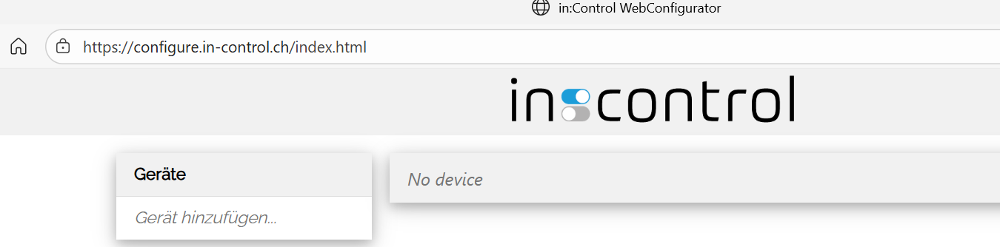

# Configurator

The *Configurator* is a web app to configure in:control devices. It is available at [configure.in-control.ch](https://configure.in-control.ch).

Follow the steps for an initial configuration.

1. Plug in your device with an USB cable
2. Click the pop-up to open the *Configurator*, or open it by following the link above.
   The *Configurator* appears empty because devices must be paired with the browser before they can communicate.
   
3. In the device list, click *add device...*
4. A dialog appears. Choose the in:control device and select connect.
    
5. The device appears in the device list and is selected automatically.

From here the device connects automatically with the *Configurator* when it's opened on the same PC and browser. For using an other PC or browser, pair the device with the new setup.

